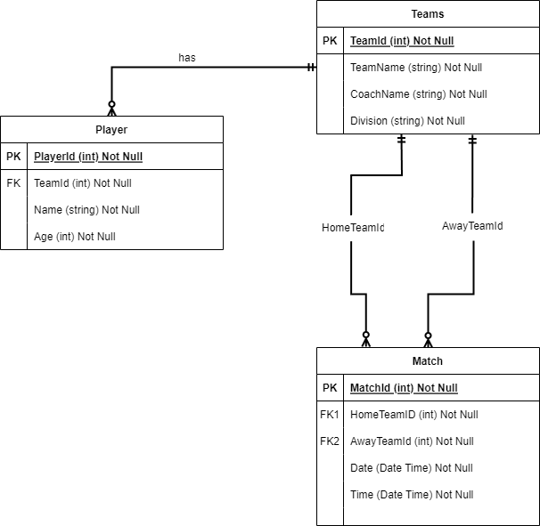

# GPFC Management System

## Derik Mahan - CIDM 3312 (Done)

## Project Overview
The **GPFC Management System** is designed for the Gregory Portland Futbal Club to efficiently manage teams, players, and matches. Built using ASP.NET Core and Entity Framework Core, this application supports essential functionalities such as match scheduling, team management, and player registration.

## Entity-Relationship Diagram (ERD)
The ERD for the system includes entities such as Team, Player, and Match with relationships defined to ensure data integrity and relevance.

### Entities and Their Attributes
- **Team**
  - `TeamId` (int): A unique identifier for each team.
  - `TeamName` (string): The name of the team.
  - `CoachName` (string): The name of the team coach.
  - `Division` (string): The division the team belongs to (U6, U8, U10, U12).

- **Player**
  - `PlayerId` (int): A unique identifier for each player.
  - `Name` (string): The full name of the player.
  - `Age` (int): The age of the player.
  - `TeamId` (int, FK): Foreign key linking to the Team entity.

### Future Implementation (Phase 2)
- **Match**
  - `MatchId` (int): A unique identifier for each match.
  - `Date` (DateTime): The date when the match is scheduled.
  - `HomeTeamId` (int, FK): Foreign key linking to the Team entity (home team).
  - `AwayTeamId` (int, FK): Foreign key linking to the Team entity (away team).

## Functionality
### Initial Release
- **Team Management**: View team details, including a list of players.
- **Player Directory**: List all players showing their associated team.

## Business Rules
- Each team must have a unique name and coach.
- Teams consist of multiple players, but each player can belong to only one team at a time.
- Players must be correctly aged for their division.

## Implementation Notes
- **Data Integrity**: Ensure all data entries adhere to defined formats and constraints (no negative ages, valid team associations).
- **User Interface**: Scaffold basic CRUD operations for Teams and Players. Extend as project scope allows.

## Entity-Relationship Diagram (ERD)

